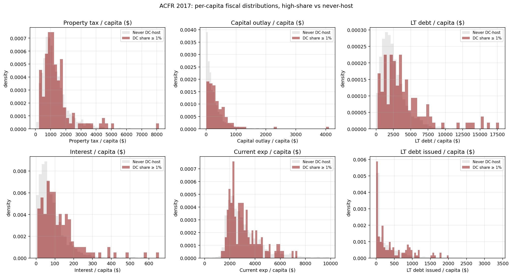

# ACFR 2017 Mechanism Check — High-DC-Share Counties vs Never-Host

*Run 2026-05-16. Cross-sectional descriptive on 2017 ACFR (the most recent reliable Census of Governments year).*

**Treatment**: 124 counties with DC tax share ≥ 1.0% (mid scenario, $50k/MW)
**Control**: 2689 counties with zero DCs in our sample period

## 1. Per-capita fiscal variables ($ per resident, 2017)

| Variable | Control median | High-share median | High − Control (median) |
|---|---:|---:|---:|
| **Property tax revenue / capita** | $1,082 | $1,197 | **$+115** |
| **Capital outlay / capita** | $171 | $263 | **$+92** |
| **LT debt outstanding / capita** | $2,143 | $3,407 | **$+1,264** |
| **Interest on debt / capita** | $64 | $100 | **$+35** |
| **Current expenditure / capita** | $2,748 | $2,874 | **$+126** |
| **LT debt issued / capita** | $129 | $213 | **$+83** |

*Medians used because distributions are right-skewed.*

## 2. State-FE regression — high-share vs control, controlling for size

Specification: `y / capita ~ high_share + state FE + log(population)`. SEs robust.

| Variable | β (high_share) | SE | t-stat |
|---|---:|---:|---:|
| **Property tax revenue / capita** | $+543*** | $180 | +3.02 |
| **Capital outlay / capita** | $+166* | $92 | +1.80 |
| **LT debt outstanding / capita** | $+1,204*** | $350 | +3.44 |
| **Interest on debt / capita** | $+41** | $18 | +2.30 |
| **Current expenditure / capita** | $+294** | $121 | +2.42 |
| **LT debt issued / capita** | $+29 | $65 | +0.45 |

*Stars: \*\*\* p<0.01, \*\* p<0.05, \* p<0.10.*

## 3. Interpretation

**Property tax revenue per capita**: high-share counties at median $1,197/resident vs control $1,082/resident.
  Ratio: 1.11x. Direction consistent with DC pumping the property-tax base.

**Capital outlay per capita**: high-share $263 vs control $171.
  Ratio: 1.54x. Direction consistent with DC fiscal slack supporting infrastructure.

**LT debt outstanding per capita**: high-share $3,407 vs control $2,143.
  Ratio: 1.59x. Reading: high-share counties have HIGHER per-capita debt — possibly using DC fiscal capacity to borrow MORE for capex.

**What this is not**:
1. Cross-sectional, not causal. High-share counties are tiny rural; smaller counties have different fiscal patterns intrinsically.
2. Only 2017 ACFR. We can't see pre/post within these same counties.
3. Selection: DCs locate where land is cheap AND fiscal-incentive regimes are favorable — that endogeneity is in here.
4. The state-FE regression in Section 2 partially controls for state-level fiscal regimes but not for unobserved county-level characteristics.
