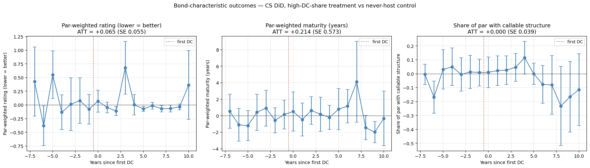

# Bond-characteristic outcomes — CS DiD on 1%-threshold sample

*Run 2026-05-16. Source: `scripts/python/20_bond_chars_outcomes.py`.*

Treatment: 125 counties with DC tax share ≥ 1%. Control: 2,776 never-DC-host counties. Panel 2010–2025.
Outcomes are county-year par-weighted aggregates of deal-level par-weighted tranche aggregates.

## Coverage of bond-characteristic outcomes

| Outcome | # county-year cells | Median |
|---|---:|---:|
| **Par-weighted rating (lower = better)** | 15,548 | 1.000 |
| **Par-weighted maturity (years)** | 37,112 | 3.155 |
| **Share of par with callable structure** | 36,702 | 0.901 |

## ATT results (Callaway–Sant'Anna)

| Outcome | ATT | SE | 95% CI | N (obs) |
|---|---:|---:|---|---:|
| **Par-weighted rating (lower = better)** | +0.0654 (0.0545) | 0.0545 | [-0.0414, +0.1723] | 4,918 |
| **Par-weighted maturity (years)** | +0.2135 (0.5731) | 0.5731 | [-0.9097, +1.3367] | 19,244 |
| **Share of par with callable structure** | +0.0003 (0.0390) | 0.0390 | [-0.0761, +0.0767] | 18,872 |

*Stars: \*\*\* p<0.01, \*\* p<0.05, \* p<0.10.*

## Event-study buckets (CS event-time ATT averaged within windows)

| Outcome | t=−5..−2 | t=0 | t=+1..+3 | t=+4..+7 | t≥+8 |
|---|---:|---:|---:|---:|---:|
| **Par-weighted rating (lower = better)** | +0.127 | +0.070 | +0.174 | -0.038 | +0.028 |
| **Par-weighted maturity (years)** | -0.100 | +0.513 | +0.119 | +1.464 | -0.294 |
| **Share of par with callable structure** | +0.022 | +0.010 | +0.031 | -0.010 | -0.126 |

## Interpretation

**Rating (numeric scale, lower = better)**: ATT = +0.065 (SE 0.055). 
  Positive coefficient = bond ratings WORSEN post-DC. Surprising.

**Maturity (years)**: ATT = +0.214 (SE 0.573). 
  Roughly no change. Maturity choice may not be driven by fiscal-capacity dynamics.

**Callable share**: ATT = +0.0003 (SE 0.0390). 
  ≈ 0 — call structure largely unchanged.

### Caveats
1. Rating data is **sparse**: ~17% of muni tranches carry an agency rating (the rest are NR or insured). Selection: rated bonds are typically larger / higher-quality issues, so the rating outcome is for a non-random subset.
2. Maturity is par-weighted across all tranches in a deal, including short serials. Long-end maturity may not move much.
3. Callable share is the share of par with explicit `CALL_FLAG=Y`; SDC field has ~99% coverage among tranches but the definition of "callable" varies (some call provisions are restrictive).