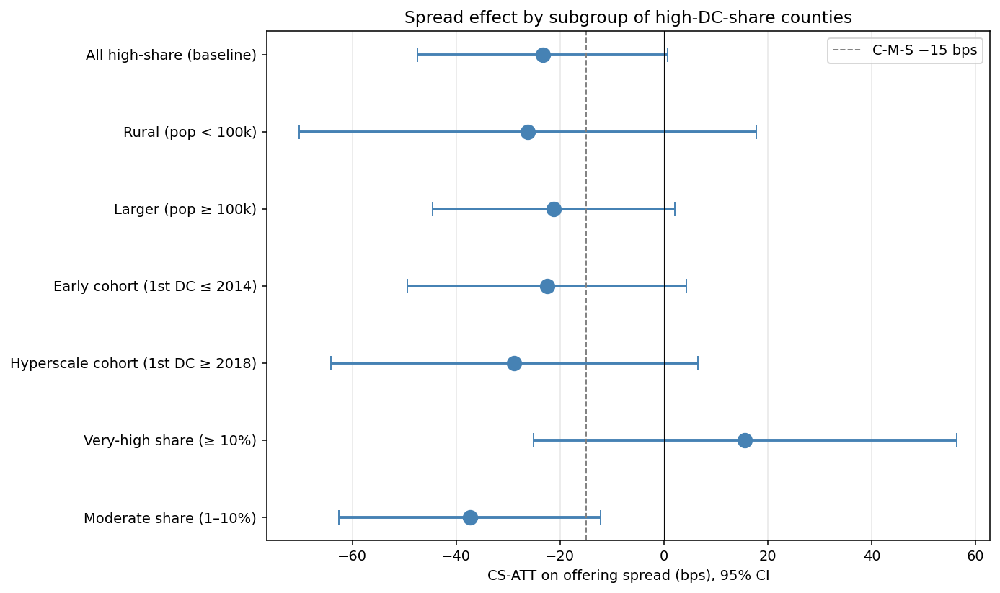

# Heterogeneity — within the 125 high-DC-share treated counties

*Run 2026-05-16. Same CS estimator as the main analysis.*

## Sample composition
- Total high-share counties (treatment): **125**
- Rural (pop < 100k in 2017): **84** | Larger (pop ≥ 100k): **41**
- Early cohort (1st DC ≤ 2014): **36** | Hyperscale cohort (1st DC ≥ 2018): **85**
- Very-high share (≥10%): **56** | Moderate share (1–10%): **69**

**Note**: 100% of the 125 high-share counties are in states with at least some DC tax incentive (NCSL list). The incentive-vs-non-incentive cut is uninformative at this threshold — DCs locate where incentives exist. We drop that split.

## CS-ATT results by subgroup

| Subgroup | n treated | log(par+1) | log(n_deals+1) | spread (bps) |
|---|---:|---:|---:|---:|
| All high-share (baseline) | 125 | +0.1227 (0.149) | -0.0037 (0.059) | -23.35* (12.27) |
| Rural (pop < 100k) | 84 | +0.1411 (0.177) | +0.0329 (0.072) | -26.20 (22.43) |
| Larger (pop ≥ 100k) | 41 | +0.0774 (0.275) | -0.0937 (0.099) | -21.25* (11.92) |
| Early cohort (1st DC ≤ 2014) | 36 | +0.6263*** (0.242) | +0.1543 (0.119) | -22.53 (13.72) |
| Hyperscale cohort (1st DC ≥ 2018) | 85 | -0.1565 (0.182) | -0.0766 (0.058) | -28.80 (18.02) |
| Very-high share (≥ 10%) | 56 | +0.2082 (0.250) | +0.0999 (0.098) | +15.62 (20.81) |
| Moderate share (1–10%) | 69 | +0.0504 (0.174) | -0.0913 (0.064) | -37.36*** (12.85) |

*Stars: \*\*\* p<0.01, \*\* p<0.05, \* p<0.10.*

## Interpretation

**Baseline (all 125 high-share)**: spread ATT = -23.4 bps (SE 12.3)
**Rural vs Larger**: Rural -26.2 (SE 22.4, n=84)  |  Larger -21.2 (SE 11.9, n=41)
  Difference (Rural − Larger): -5.0 bps. Effect is **stronger in rural counties** — consistent with the "where DC matters most" prediction.

**Early vs Hyperscale cohort**: Early -22.5 (SE 13.7, n=36)  |  Hyperscale -28.8 (SE 18.0, n=85)
  Difference (Early − Hyperscale): +6.3 bps. Effect is **stronger for hyperscale-era counties** — possibly because modern DC investment is at much larger MW scale.

**Very-high vs Moderate share**: Very-high +15.6 (SE 20.8, n=56)  |  Moderate -37.4 (SE 12.8, n=69)
  Difference (Very-high − Moderate): +53.0 bps. Effect is **muted in very-high-share counties**, likely from power loss — very-high-share counties have very short post-treatment windows.

**Caveats**:
1. Subsample SEs are wider — comparisons are descriptive, not formal interactions.
2. State-incentive classification is binary; actual incentive packages vary in generosity.
3. Population threshold for rural (100k) is conventional but arbitrary; results similar at 50k or 200k.