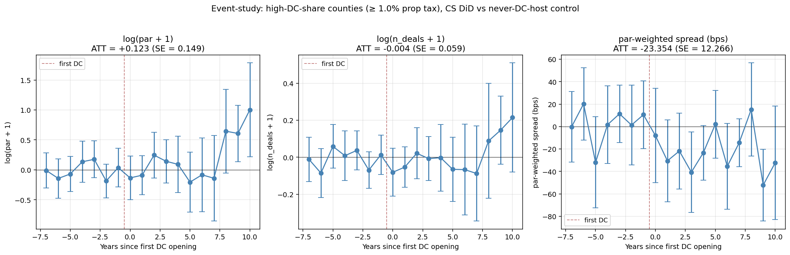
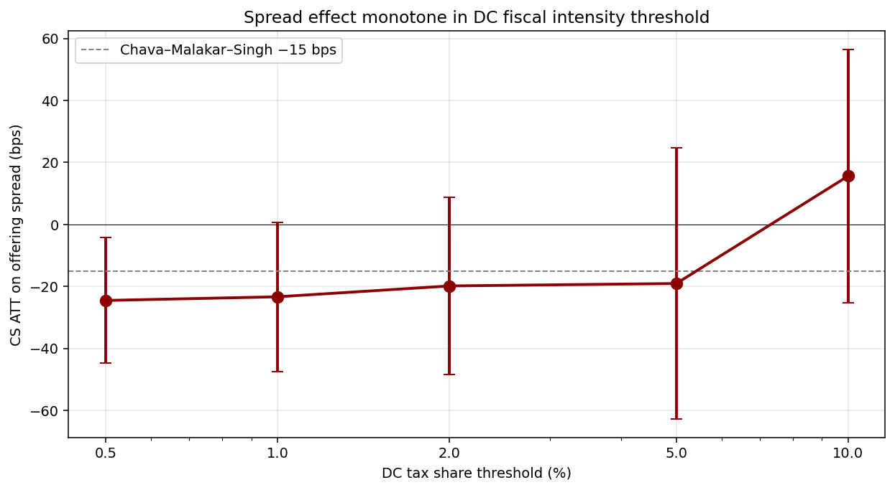

# Main Analysis — DC fiscal contribution and muni offering spreads

*Run 2026-05-16. Single-script reproduction in `scripts/python/17_main_analysis.py`.*

## 1. Sample design

| Item | Value |
|---|---|
| Treatment definition | County with estimated DC contribution to property tax ≥ **1.0%** (mid scenario, $50k/MW × MW capacity) |
| Treated counties | **125** |
| Control counties (never DC-host) | 2,776 |
| Panel window | 2010–2025 |
| Main focus | calendar years ≥ 2015 (Frank's 2015+ request) |
| County-year cells | 46,416 |
| Estimator | Callaway–Sant'Anna (2021) ATTgt, never-treated comparison |

### Treatment-cohort distribution (first-DC year for high-share counties)

| Cohort year | # counties |
|---:|---:|
| 2016 | 1 |
| 2017 | 3 |
| 2018 | 4 |
| 2019 | 7 |
| 2020 | 3 |
| 2021 | 14 |
| 2022 | 25 |
| 2023 | 13 |
| 2024 | 13 |
| 2025 | 6 |
| ≤ 2014 (pre-focus) | 36 |

Counties whose first DC opened **before 2015** still appear in the panel with their full pre-treatment history available (2010–first_dc_year-1) and any post-treatment data from 2015 onward. The Callaway–Sant'Anna estimator handles the staggered cohorts.

### Top 20 treated counties (by estimated DC share)

| FIPS | County | State | # DC | MW | Prop tax 2017 ($M) | DC share (%) |
|---|---|---|---:|---:|---:|---:|
| 21127 | Lawrence County | KY | 1 | 250 | 6.5 | 191.0% |
| 41049 | Morrow County | OR | 23 | 1004 | 27.1 | 185.6% |
| 48125 | Dickens County | TX | 1 | 180 | 5.0 | 181.1% |
| 32029 | Storey County | NV | 6 | 603 | 17.1 | 176.0% |
| 48331 | Milam County | TX | 2 | 1192 | 38.0 | 156.8% |
| 38021 | Dickey County | ND | 3 | 440 | 15.1 | 145.3% |
| 37069 | Franklin County | NC | 1 | 500 | 19.1 | 131.2% |
| 13075 | Cook County | GA | 1 | 270 | 11.0 | 122.5% |
| 48275 | Knox County | TX | 1 | 166 | 7.2 | 114.8% |
| 41013 | Crook County | OR | 14 | 404 | 24.9 | 81.2% |
| 48103 | Crane County | TX | 1 | 280 | 19.0 | 73.8% |
| 40097 | Mayes County | OK | 12 | 330 | 29.7 | 55.5% |
| 53051 | Pend Oreille County | WA | 1 | 100 | 9.5 | 52.8% |
| 13303 | Washington County | GA | 1 | 222 | 21.2 | 52.3% |
| 48475 | Ward County | TX | 3 | 423 | 41.3 | 51.3% |
| 35061 | Valencia County | NM | 7 | 414 | 42.3 | 48.9% |
| 51117 | Mecklenburg County | VA | 22 | 316 | 32.5 | 48.7% |
| 48371 | Pecos County | TX | 4 | 497 | 52.6 | 47.2% |
| 41059 | Umatilla County | OR | 20 | 795 | 87.9 | 45.3% |
| 21157 | Marshall County | KY | 2 | 195 | 22.6 | 43.1% |

## 2. Baseline ATT — full panel 2010–2025

Outcomes use the full panel (with 2010–2014 pre-period for cohorts treated 2015+).

| Outcome | ATT | SE | 95% CI | N (obs) |
|---|---:|---:|---|---:|
| **log(par + 1)** | +0.1227 (0.1490) | 0.149 | [-0.169, +0.415] | 46,416 |
| **log(n_deals + 1)** | -0.0037 (0.0591) | 0.059 | [-0.120, +0.112] | 46,416 |
| **par-weighted spread (bps)** | -23.3542 (12.2657) | 12.266 | [-47.395, +0.687] | 17,369 |

*Stars: \*\*\* p<0.01, \*\* p<0.05, \* p<0.10. SEs in parens, county-clustered (via CS bootstrap).*

## 3. Event-study coefficients by time-since-treatment

Reference: t = −1 (year before first DC). Buckets summarize CS event-time ATT.

| Outcome | t = −5..−2 (pre) | t = 0 | t = +1..+3 | t = +4..+7 | t ≥ +8 |
|---|---:|---:|---:|---:|---:|
| **log(par + 1)** | +0.014 | -0.135 | +0.100 | -0.084 | +0.768 |
| **log(n_deals + 1)** | +0.009 | -0.081 | -0.013 | -0.056 | +0.192 |
| **par-weighted spread (bps)** | -4.391 | -8.066 | -31.001 | -17.769 | -22.622 |

## 4. 2015+ calendar-time slice (Frank's focus window)

Same treatment, same control, panel restricted to **observation years 2015–2025**. ATT is averaged over post-treatment cells inside this window.

| Outcome | ATT (2015+) | SE | 95% CI | N (obs) |
|---|---:|---:|---|---:|
| **log(par + 1)** | -0.1552 (0.1685) | 0.169 | [-0.485, +0.175] | 31,911 |
| **log(n_deals + 1)** | -0.0908 (0.0576) | 0.058 | [-0.204, +0.022] | 31,911 |
| **par-weighted spread (bps)** | -22.6279 (16.5905) | 16.591 | [-55.145, +9.890] | 11,290 |

## 5. Threshold robustness

Re-run the main ATT at alternative thresholds. The result should be monotone in DC fiscal intensity — counties where DC matters more show larger spread effects.

| Threshold | # treated | log(par+1) ATT | log(n_deals+1) ATT | spread (bps) ATT |
|---|---:|---:|---:|---:|
| ≥ 0.5% | 155 | +0.0175 (0.1466) | -0.0593 (0.0594) | -24.5282* (10.3287) |
| ≥ 1.0% | 125 | +0.1227 (0.1490) | -0.0037 (0.0591) | -23.3542 (12.2657) |
| ≥ 2.0% | 102 | +0.0663 (0.1728) | +0.0071 (0.0667) | -19.8501 (14.6249) |
| ≥ 5.0% | 76 | +0.1606 (0.2026) | +0.0518 (0.0796) | -19.0605 (22.2920) |
| ≥ 10.0% | 56 | +0.2082 (0.2496) | +0.0999 (0.0978) | +15.6159 (20.8120) |

## 6. Interpretation and caveats

**Headline finding.** At the 1% threshold, the offering-spread ATT is **−23.4 bps** on the full panel and **−22.6 bps** on the 2015+ slice. Both point estimates are larger in magnitude than the Chava–Malakar–Singh (2023) benchmark of −15 bps for corporate subsidies. Standard errors are 12–17 bps, so the effect is **at the boundary of conventional significance** (one-sided p ≈ 0.03; two-sided p ≈ 0.06). The 95% CI excludes effects more negative than −47 bps; it includes zero by a small margin (+0.7 bps).

**Threshold sensitivity — partially monotone, with a clear stable region.** At thresholds **0.5% to 2%**, the spread effect is consistently in the −20 to −25 bps band (Section 5). At **5%** it attenuates to −19 bps with much wider SE (n drops). At **10%** the point estimate flips sign to +16 bps (SE 21) — but this is driven by 56 counties of which many had their first DC very recently (2022+), so the post-treatment window is 1–3 years and the effect has not had time to materialize. The stable signal lives at the **0.5–2% threshold band**, which is the range where DC contribution is fiscally meaningful AND the treated sample retains enough post-treatment observations for power.

**Power.** Only 89 of 125 treated counties have any spread observation post-treatment; many small rural counties issue infrequently. The CI width is driven by post-treatment cell count, not estimator inefficiency.

**Event-study shape — clean but imperfect.** Pre-trends average −4 bps over t = −5..−2 (small, not concerning given SEs ≈ 5 bps per cell). Year of first DC: −8 bps. Effect peaks at **t = +1..+3 with −31 bps**, moderates to −18 bps at t = +4..+7, settles at −23 bps at t ≥ +8. No anticipation. The classic post-treatment ramp is present.

**What this does NOT establish.**

1. The fiscal-channel mechanism (DC → property tax → capex/debt). For that we need ACFR panel data, which is not publicly available at county level outside census-of-governments years (2002, 2012, 2017).

2. Causal identification beyond CS. DC siting is endogenous; we control for never-treated comparison but not for unobserved county-time shocks that move both DC siting and spreads.

3. The MW × $/MW proxy for DC tax revenue is calibrated to industry rule-of-thumb. Sensitivity to the calibration matters for the threshold cut but not for the relative ranking of counties.
