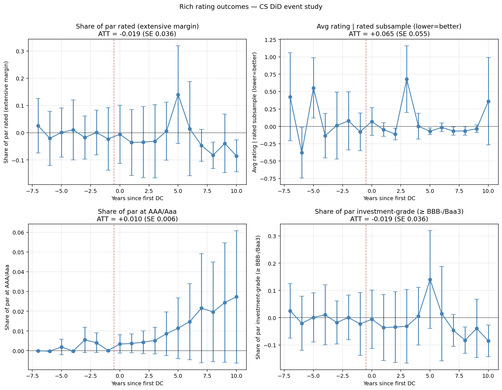

# Rich rating outcomes — CS DiD on 1%-threshold sample

*Run 2026-05-16. Source: `scripts/python/21_rating_outcomes_rich.py`.*

Treatment: 125 counties with DC tax share ≥ 1%. Control: 2,776 never-DC-host counties. Panel 2010–2025.

Six rating-related outcomes split the question into extensive (do they get rated?), quality (how high?), and within-rated subsample (avg rating among rated).

## Coverage (county-year cells with non-null value)

| Outcome | N cells | Median |
|---|---:|---:|
| Share of par rated (extensive margin) | 37,177 | 0.000 |
| Avg rating | rated subsample (lower=better) | 15,563 | 1.000 |
| Share of par at AAA/Aaa | 37,177 | 0.000 |
| Share of par investment-grade (≥ BBB-/Baa3) | 37,177 | 0.000 |
| Moody-only avg rating (lower=better) | 10,247 | 1.000 |
| S&P-only avg rating (lower=better) | 13,033 | 1.000 |

## CS-ATT results

| Outcome | ATT | SE | t | 95% CI | N (obs) |
|---|---:|---:|---:|---|---:|
| **Share of par rated (extensive margin)** | -0.0193 | 0.0364 | -0.53 | [-0.0905, +0.0520] | 19,246 |
| **Avg rating | rated subsample (lower=better)** | +0.0654 | 0.0545 | +1.20 | [-0.0414, +0.1723] | 4,918 |
| **Share of par at AAA/Aaa** | +0.0097 | 0.0064 | +1.52 | [-0.0028, +0.0223] | 19,246 |
| **Share of par investment-grade (≥ BBB-/Baa3)** | -0.0193 | 0.0364 | -0.53 | [-0.0905, +0.0520] | 19,246 |
| **Moody-only avg rating (lower=better)** | -0.0663 | 0.1623 | -0.41 | [-0.3844, +0.2519] | 878 |
| **S&P-only avg rating (lower=better)** | +0.0111 | 0.0092 | +1.21 | [-0.0069, +0.0292] | 4,743 |

*Stars: \*\*\* p<0.01, \*\* p<0.05, \* p<0.10.*

## Event-study buckets

| Outcome | t=−5..−2 | t=0 | t=+1..+3 | t=+4..+7 | t≥+8 |
|---|---:|---:|---:|---:|---:|
| **Share of par rated (extensive margin)** | -0.0014 | -0.0059 | -0.0340 | +0.0285 | -0.0490 |
| **Avg rating | rated subsample (lower=better)** | +0.1274 | +0.0702 | +0.1743 | -0.0379 | +0.0280 |
| **Share of par at AAA/Aaa** | +0.0028 | +0.0034 | +0.0044 | +0.0141 | +0.0521 |
| **Share of par investment-grade (≥ BBB-/Baa3)** | -0.0014 | -0.0059 | -0.0340 | +0.0285 | -0.0490 |
| **Moody-only avg rating (lower=better)** | +1.0753 | +0.4251 | +nan | -0.5474 | -0.0765 |
| **S&P-only avg rating (lower=better)** | +0.0327 | +0.0579 | +0.0003 | -0.0001 | -0.0051 |

## Interpretation

- **Share of par rated (extensive margin)**: -0.0193 (SE 0.0364, t=-0.5). Null.
- **Avg rating | rated subsample (lower=better)**: +0.0654 (SE 0.0545, t=+1.2). Null.
- **Share of par at AAA/Aaa**: +0.0097 (SE 0.0064, t=+1.5). Null.
- **Share of par investment-grade (≥ BBB-/Baa3)**: -0.0193 (SE 0.0364, t=-0.5). Null.
- **Moody-only avg rating (lower=better)**: -0.0663 (SE 0.1623, t=-0.4). Null.
- **S&P-only avg rating (lower=better)**: +0.0111 (SE 0.0092, t=+1.2). Null.

### Honest reading

If **share_rated** moves up, it would mean DC counties seek public ratings more often after DC arrival (extensive margin — relevant for small rural counties that may not have been rated before).

If **rated_avg_rating** moves down (toward 1=AAA), it would mean DC counties already getting rated see their rating quality IMPROVE post-DC (intensive margin — fiscal capacity → better credit).

If **share_aaa** moves up and **share_ig** moves up, that's a distributional shift toward better credit quality, consistent with the fiscal-capacity story.

The per-agency splits tell us whether the rating change is driven by one specific agency (e.g., S&P's methodology weights different muni factors than Moody's).
