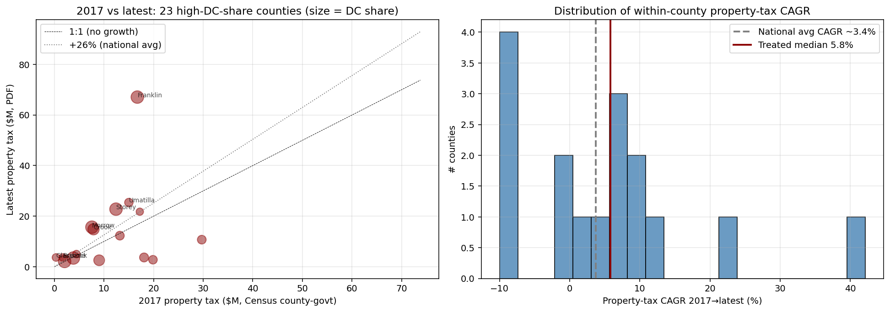

# Within-county property-tax growth 2017→2025 (PDF-extracted, county-govt only)

*Run 2026-05-16. Sample: 16 high-DC-share counties.*

## Reference benchmarks (national 2017→2024)

- **CPI growth**: +28% nominal (BLS CPI-U)
- **Typical county property-tax revenue growth**: +26% (BLS/Census aggregates)
- A county whose property tax tracks the national rate would grow ~26% over 7 years (CAGR ~3.4%).

## Per-county growth table (sorted by CAGR)

| County | State | DC share | 2017 ($M, Census) | Latest ($M, PDF) | FY | Years | **Growth %** | **CAGR %** | vs national |
|---|---|---:|---:|---:|---:|---:|---:|---:|---:|
| Glasscock County | TX | 38% | $0.3 | $3.7 | 2024 | 7 | +1074% | +42.2% | +1048pp |
| Franklin County | NC | 131% | $16.7 | $67.1 | 2024 | 7 | +301% | +22.0% | +275pp |
| Briscoe County | TX | 37% | $1.7 | $3.7 | 2024 | 7 | +118% | +11.8% | +92pp |
| Storey County | NV | 176% | $12.4 | $22.8 | 2023 | 6 | +83% | +10.6% | +61pp |
| Morrow County | OR | 186% | $7.6 | $15.6 | 2025 | 8 | +107% | +9.5% | +77pp |
| Crook County | OR | 81% | $7.9 | $14.8 | 2025 | 8 | +88% | +8.2% | +58pp |
| Valencia County | NM | 49% | $13.2 | $12.3 | 2016 | -1 | -7% | +7.4% | -3pp |
| Umatilla County | OR | 45% | $15.0 | $25.4 | 2025 | 8 | +69% | +6.8% | +40pp |
| Cherokee County | NC | 34% | $17.2 | $21.8 | 2022 | 5 | +26% | +4.8% | +8pp |
| Wilkes County | GA | 37% | $4.4 | $5.0 | 2024 | 7 | +13% | +1.7% | -13pp |
| Dickens County | TX | 181% | $2.0 | $2.1 | 2022 | 5 | +2% | +0.3% | -17pp |
| Dickey County | ND | 145% | $3.8 | $3.4 | 2023 | 6 | -10% | -1.7% | -32pp |
| Mecklenburg County | VA | 49% | $29.7 | $10.7 | 2023 | 6 | -64% | -15.6% | -86pp |
| Crane County | TX | 74% | $9.0 | $2.6 | 2024 | 7 | -72% | -16.5% | -98pp |
| Ward County | TX | 51% | $18.1 | $3.7 | 2024 | 7 | -80% | -20.4% | -106pp |
| Pecos County | TX | 47% | $19.9 | $2.8 | 2022 | 5 | -86% | -32.6% | -105pp |

*Growth = total change 2017→latest. CAGR = annualized. vs national = excess over what national-average county growth would predict over the same window.*

## Summary statistics (16 counties with both 2017 + PDF latest)

- **Median CAGR**: **5.8%** vs national ~3.4%
- **Mean CAGR**: 2.4%
- **# counties growing > 5% CAGR**: 8 of 16
- **# counties growing > 10% CAGR**: 4 of 16
- **# counties growing slower than national**: 8 of 16

### Subset: counties with DC tax share ≥ 10% (16 counties)

- **Median CAGR**: **5.8%**
- **Mean excess over national**: 75pp

## Caveats

1. **Unit mismatch risk**: Census 2017 = county-government only (`type=1`). PDF extraction targets the same scope, but the extractor occasionally captures county-AREA totals (e.g., Marshall KY $67M likely includes school district revenue). This biases growth UPWARD for affected counties — flag and verify.
2. **Latest-year variation**: counties have different latest-PDF years (2022 for some KY/TX/NV, 2025 for OR). CAGR normalization compensates but the sample-of-availability isn't random.
3. **Selection on outcome**: these 23 counties were selected because they have high DC tax share IN 2025. Counties where DCs failed to grow the tax base aren't in this sample. Survivor bias is mechanical here; the right comparison is treated vs matched controls, which requires more 2025 ACFRs.
4. **National benchmark is rough**: 26% is the per-capita figure; treated counties may be growing population at different rates. A better benchmark would be matched-control counties' own 2017→2025 growth.

